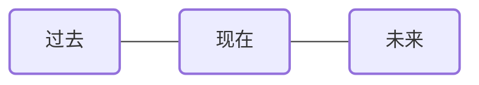

# 时间牌阵

## 牌阵图示

## 占卜主题
适用于任何占卜主题

## 排阵含义

**一、过去位**：揭示影响当前情况的过去事件、经历或心态，帮助理解现状的根源。

**二、现在位**：反映当前面临的处境、挑战或机遇，展示此刻的能量状态。

**三、未来位**：预示即将到来的发展趋势或可能的结果，提供前进方向的指引。

### 解读思路：

| 位置         | 代表       | 详细解读                                                               |
| ------------ | ---------- | ---------------------------------------------------------------------- |
| **过去位**   | 基础与根源 | 揭示事件的起源，过去的经验和模式如何影响现在，理解当前状况的历史背景   |
| **现在位**   | 当下状态   | 展示面临的处境和挑战，当前的能量状态，需要关注的焦点，以及可采取的行动 |
| **未来位**   | 发展趋势   | 预示事态的可能发展方向，潜在结果，以及前进道路上的指引和建议           |
| **整体关联** | 时间流动   | 观察三个位置牌之间的联系，能量如何从过去流向未来，识别模式和转折点     |
| **调整可能** | 改变契机   | 如遇不理想的未来暗示，回看过去和现在位，找出可调整的思维模式和行为习惯 |

> 提示：改变未来最好的方法是从当下行动，而理解过去则是做出明智决策的关键。时间牌阵虽简单，但能提供清晰的时间脉络视角，帮助我们在时间流中找到自己的位置和方向。