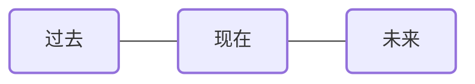

# 是非牌阵

## 牌阵图示

## 占卜主题
适用于寻求明确答案的二元问题，如：
- 某事会不会发生
- 某个决定能不能实现
- 某个方向行不行得通
- 某人爱不爱我
- 某个选择是否正确

## 取牌方式
随机抽取三张塔罗牌，分别代表过去、现在和未来。

## 排阵含义
1. **全正位**：结果为肯定。表示"是、会、能、行、爱"等积极答案。这种组合显示事情发展顺利，无明显阻碍。

2. **两正一逆**：结果倾向肯定，可能性较高。逆位牌所在位置提示你需要注意和改善的方面，解决这个问题将大大提高成功率。

3. **一正两逆**：结果倾向否定，可能性较低。两张逆位牌指出了主要障碍，若能认真面对并解决这些问题，仍有转机。

4. **全逆位**：结果为否定。表示"否、不会、不能、不行、不爱"等消极答案。建议重新评估期望或寻找其他途径。

## 解读思路

1. **位置意义**：
   - 过去牌：问题的根源或已经发生的影响因素
   - 现在牌：当前面临的情况或态度
   - 未来牌：事态的发展方向或最终结果

2. **牌面解读**：
   - 正位牌：代表有利因素、积极能量或需要继续发扬的品质
   - 逆位牌：代表阻碍、挑战或需要改正的问题

3. **整体评估**：综合三张牌的能量和象征意义，不仅关注最终结果，也要理解促成该结果的原因和过程。