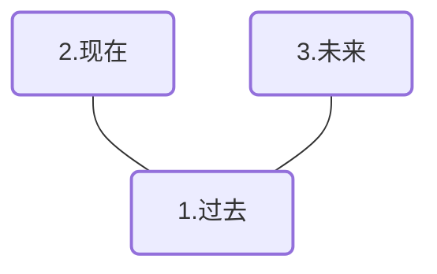

# 圣三角牌阵

## 牌阵图示

## 取牌方式
随机抽取

## 占卜主题
圣三角牌阵是一种经典而通用的塔罗牌阵，适合几乎所有类型的问题。它特别适合于：
- 了解一个情况的发展过程
- 洞察问题的根源及其可能的结果
- 简短而明确的指导与建议
- 初学者入门及快速占卜

此牌阵可以单独使用大阿卡纳牌进行占卜，也可以使用完整的塔罗牌组（大小阿卡纳全部）来获取更详细的信息。

## 排阵含义

| 位置 | 代表 | 详细解读                                                                                                         |
| ---- | ---- | ---------------------------------------------------------------------------------------------------------------- |
| 一   | 过去 | 揭示问题的起源、根源或基础。这张牌展示了哪些过去的事件、态度或能量导致了当前的状况，帮助我们理解问题的历史背景。 |
| 二   | 现在 | 反映当前的状态、挑战或机遇。这张牌描述了问题的现状和当下影响你的能量，以及你目前所处的环境和心态。               |
| 三   | 未来 | 预示潜在的结果或即将到来的能量。这张牌不代表固定的命运，而是显示如果当前路径继续发展可能出现的趋势和可能性。     |

## 解读思路

圣三角牌阵虽简洁，但解读时应注意以下几点：

1. **时间流动**：从左到右（或从下到上）观察牌阵中能量的流动，看问题如何从过去发展到现在，并将如何延伸到未来。

2. **牌与牌的关联**：三张牌之间存在内在联系，注意它们如何相互影响和互动。寻找共同的元素、符号或主题，这些可能是关键的信息点。

3. **元素平衡**：观察三张牌中的元素类型（权杖、圣杯、宝剑、星币）或能量（主牌的数字、人物等），是否存在特定元素的集中或缺失。

4. **整体故事**：将三张牌视为一个完整的叙事，而不仅是孤立的信息点。试着用这三张牌讲述一个连贯的故事，这将有助于更深入地理解问题。

5. **直觉补充**：在技术分析之外，也要信任你的直觉。有时牌面可能激发的个人联想和感受，同样是解读的重要部分。
