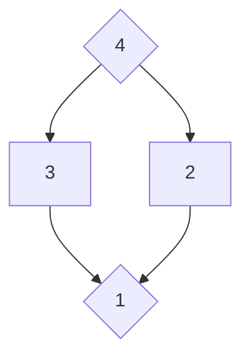

# 钻石牌阵

## 牌阵布局

## 占卜主题
适用于任何占卜主题

## 取牌方式
随机抽取

## 排阵含义

| 位置    | 代表                 | 详细解读                             |
| ------- | -------------------- | ------------------------------------ |
| 1号位置 | 当前情况或问题的核心 | 展示咨询者目前所处的状态             |
| 2号位置 | 左侧路径             | 代表第一个即将面临的挑战或机遇       |
| 3号位置 | 右侧路径             | 代表第二个即将面临的挑战或机遇       |
| 4号位置 | 最终结果             | 代表事态发展的方向，是整个事件的归宿 |

## 解读思路

1. 首先解读1号位置，了解当前情况的基础
2. 分析2号和3号位置，这两张牌代表两条可能的发展路径：
   - 正位牌通常表示某方面做得过头、过度或失衡
   - 逆位牌则通常意味着做得不够、不足或需要加强
3. 最后解读4号位置，结合前三张牌的影响，预测可能的结果

这种解读体现了"泰极否来"的思想，即任何事物发展到极致都会向反方向转化。例如对某人过分关照可能导致依赖，过度节制可能引发反弹。在解读时需寻找平衡点，提示咨询者适度而行。

解读时还可以注意牌与牌之间的关系：
- 2号和3号牌如何影响从1号到4号的发展
- 正逆位、元素属性之间的互动
- 牌面故事如何串联成一个连贯的叙事