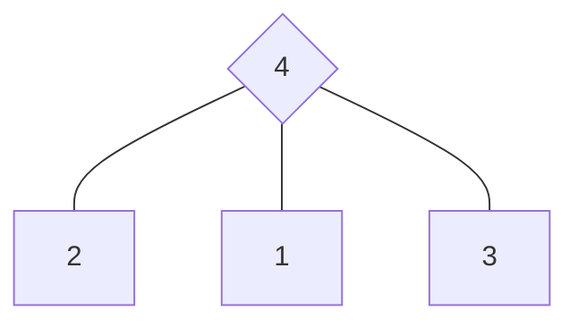

# 恋人金字塔

## 牌阵布局

### 占卜主题
适用于爱情主题

### 取牌方式
随机抽取

### 排阵含义

| 位置 | 代表                      | 详细解读                                   |
| ---- | ------------------------- | ------------------------------------------ |
| 一   | 你的内心期望与需求        | 揭示你在感情中真正渴望的事物与情感需求     |
| 二   | 恋人/对方的内心期望与需求 | 展现对方在感情中真正期待的事物与情感渴望   |
| 三   | 目前彼此关系的状态        | 反映当下关系的真实情况、主要挑战及能量流动 |
| 四   | 未来彼此关系的发展方向    | 预示关系的潜在发展轨迹和可能的结果         |

### 解读思路：

1. **从现在到未来的转变**：观察三号牌（现状）如何发展到四号牌（未来），分析这一变化背后的动力和原因。

2. **期望的影响**：检视一号和二号牌所示的双方期望，思考这些期望如何影响或促成了从现状到未来的转变。

3. **和谐与冲突**：注意一号与二号牌之间的关系是否和谐一致，若存在矛盾，可能是关系中潜在的挑战。

4. **整体能量流动**：通过金字塔结构，分析能量如何从双方的期望（底部）经由当前状态流向未来结果（顶点）。

5. **关系平衡**：评估四张牌的能量平衡，判断关系是否健康发展，以及双方是否有调整期望的必要。

这个牌阵不仅能回答关系的走向问题，还能深入探索双方的期望差异，帮助咨询者更好地理解和经营感情关系。