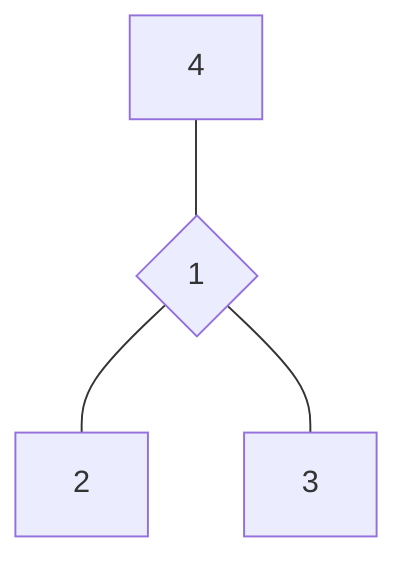

# 自我探索

## 牌阵布局

## 占卜主题
在某些处境中认清自己

## 取牌方式
随机抽取

## 解读思路：

| 位置 | 代表           | 详细解读                                                                                                                                                                  |
| ---- | -------------- | ------------------------------------------------------------------------------------------------------------------------------------------------------------------------- |
| 一   | **当前状态**   | 这张牌揭示你当前的心理和情感状态，可能体现为焦虑、矛盾、迷惘、纠结或平静等。它是理解你现在处境的基础，反映了你面对当前环境的真实感受。                                    |
| 二   | **外在表现**   | 这张牌展示你向世界呈现的一面，包括你的言行、表情、姿态和行为模式。它反映了你如何与外界互动，以及你采取的实际行动和应对方式。                                              |
| 三   | **内在想法**   | 这张牌深入你的思想世界，揭示你内心真实的期望、目标和渴望。它帮助你了解自己追求的真正目的，以及你希望事情如何发展的理想结果。                                              |
| 四   | **潜意识驱动** | 这张牌探索你行为背后的潜在动机和原始需求，可能涉及知识追求、物质安全、情感满足或自我实现等方面。它帮助你认识到驱动你行为的深层次原因，Often是你自己也未完全意识到的部分。 |

