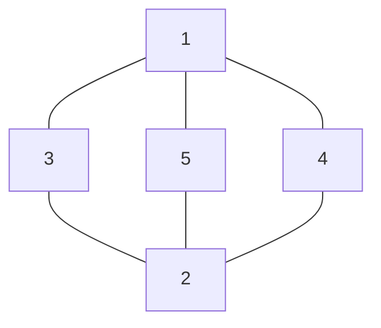

# 吉普赛十字

## 牌阵布局

## 占卜主题
占卜爱情主题

## 解读思路

| 位置 | 代表               | 详细解读                                                                                                                                                         |
| ---- | ------------------ | ---------------------------------------------------------------------------------------------------------------------------------------------------------------- |
| 1    | 对方的想法         | 深入分析对方内心真实想法，关注其情感需求和心理状态。通过这张牌可以了解对方是否认真考虑这段关系，以及他们对未来的期待。                                           |
| 2    | 你的想法           | 客观审视自己的期望与态度，思考自己能为关系付出什么。这张牌帮助你认清自己的真实情感，以及你在关系中的定位和责任。                                                 |
| 3    | 相处中存在的问题   | 若是正位，需将其表示的含义适当减弱；若是逆位，则指出需要你改正的问题。在关系中，过度关注和过度放任都是不可取的。这张牌揭示了当前关系中需要面对和解决的核心问题。 |
| 4    | 二人目前的人文环境 | 评估周围环境对爱情的影响，包括双方家庭背景、事业发展、时间条件与空间距离等因素。这些外部条件可能促进或阻碍关系发展，了解它们有助于做出更现实的决策。             |
| 5    | 二人关系发展的结果 | 综合前四张牌的影响，预测关系未来的发展趋势。这张牌展示了在现有条件和情况下，关系最可能的发展方向，为你提供参考和指导。                                           |

### 整体分析

分析时应结合五个位置的牌，寻找它们之间的联系和互动模式。特别注意第三位置与第四位置之间的关系，它们往往揭示了内部问题与外部环境的互相影响。

记住，塔罗预测提供的是可能性和参考，最终关系的发展仍取决于双方的行动和选择。