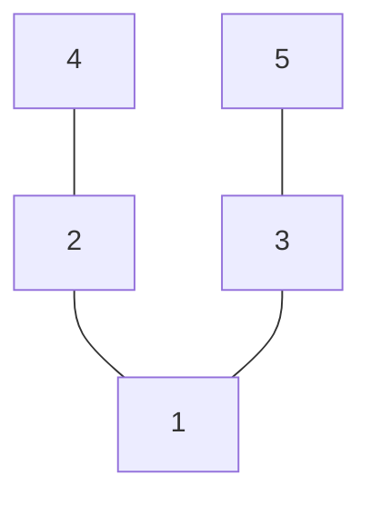

# 二选一

## 牌阵布局

## 占卜主题
多种选择

## 取牌方式
随机抽取

## 解读思路

| 位置 | 代表            | 详细解读                                                                  |
| ---- | --------------- | ------------------------------------------------------------------------- |
| 1    | 当前情况        | 理解咨询者目前的处境和内心状态。这是两个选择的共同起点。                  |
| 2    | 选择A的近未来   | 分析选择A在近期内会带来的影响。关注其能量属性、挑战和机遇。               |
| 3    | 选择B的近未来   | 分析选择B在近期内会带来的影响。关注其能量属性、挑战和机遇。               |
| 4    | 选择A的最终结果 | 评估选择A在长期会产生的结果。注意牌所暗示的成长方向、潜在风险和最终收获。 |
| 5    | 选择B的最终结果 | 评估选择B在长期会产生的结果。注意牌所暗示的成长方向、潜在风险和最终收获。 |

**解读建议：**
- 将每个选择路径的两张牌（近未来+最终结果）作为一个整体来解读，观察能量流动是否顺畅，故事发展是否合理。
- 请咨询者感受对每条路径的直觉反应，牌阵是工具而非决定者，最终决策应结合理性分析和内心指引。

如需针对三种或更多选择进行占卜，只需按照相同模式为每个额外选择增加两张牌（近未来+最终结果）即可。