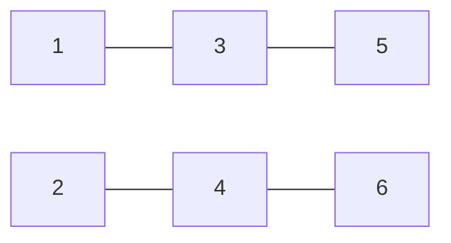

# 关系发展

## 牌阵图示

## 占卜主题
爱情或友情

## 取牌方式
随机抽取

## 排阵含义

| 位置 | 代表                       | 含义                                                                           |
| ---- | -------------------------- | ------------------------------------------------------------------------------ |
| 一   | 你对对方的看法             | 揭示你如何看待对方，包括你感知到的对方的性格特点、优缺点以及在这段关系中的表现 |
| 二   | 对方对你的看法             | 反映对方眼中的你，展示对方如何评价你的特质、行为以及在关系中扮演的角色         |
| 三   | 你认为目前的关系           | 展现你对当前关系状态的理解和感受，包括你认为关系中的优势和问题                 |
| 四   | 对方认为目前的关系         | 揭示对方对这段关系的看法和感受，对方可能没有直接表达的想法和情绪               |
| 五   | 你期望双方关系的发展结果   | 反映你内心深处对这段关系未来走向的期待和愿望                                   |
| 六   | 对方期望双方关系的发展结果 | 显示对方对这段关系发展方向的期望和规划                                         |

## 解读思路

### 基础解读
- 若只关注对方想法，可着重解读二号、四号、六号牌位
- 若需全面分析关系，应将所有牌位综合解读，寻找彼此认知的差异点

### 深度解读建议
1. **比较一号与二号牌**：分析双方对彼此的认知差异，这常常是沟通问题的根源
2. **对比三号与四号牌**：了解双方对当前关系状态的不同理解，找出潜在的误解
3. **分析五号与六号牌**：探索双方对未来期望的一致性和冲突点
4. **留意牌面的情绪基调**：积极的牌（如星星、太阳）与消极的牌（如塔、死神）在对应位置上的出现，揭示关系中的能量流动

### 注意事项
- 解读时应保持客观，不要因个人期望而扭曲牌意
- 塔罗提供的是可能性和潜在趋势，最终关系发展仍取决于双方的实际行动和沟通